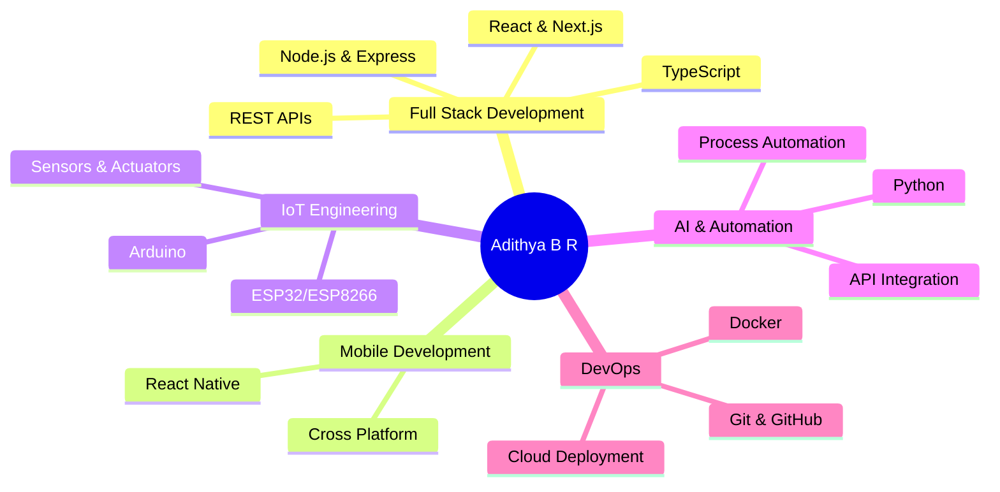

<div align="center">

# 👨‍💻 Adithya B R


[](https://github.com/adithya-b-r)
[](https://github.com/adithya-b-r?tab=followers)
[](https://github.com/adithya-b-r?tab=repositories)

</div>

---

## 🎖️ **Achievements & Impact**

<div align="center">

[](https://github.com/ryo-ma/github-profile-trophy)

</div>

<div align="center">
  
| 🎯 Metric | 📊 Value |
|-----------|----------|
| **Projects Delivered** | 25+ Production Systems |
| **Lines of Code** | 100K+ Written & Maintained |
| **Technologies Mastered** | 30+ Tools & Frameworks |
| **Live Applications** | 10+ Active Deployments |
| **IoT Devices Built** | 15+ Hardware Projects |

</div>

---

## 💼 **Professional Profile**

<table>
<tr>
<td width="60%">

```typescript
const adithya = {
    role: "Full Stack Developer & IoT Engineer",
    location: "Mangalore, Karnataka, India",
    expertise: [
        "Scalable Full-Stack Applications",
        "IoT & Embedded Systems",
        "Enterprise Solutions",
        "Modern Web Technologies"
    ],
    focus: "Delivering production-ready, user-centric solutions",
    philosophy: "Innovation through clean code and practical problem-solving"
};
```

### **Core Competencies**

<div align="center">



</div>

- 🏗️ **Architecture**: Designing scalable full-stack applications with modern best practices
- 🔧 **Development**: Building reliable enterprise solutions with clean, maintainable code
- 📡 **IoT Engineering**: Hardware-software integration for smart automation systems
- 🎯 **Problem Solving**: Tackling complex technical challenges with innovative solutions
- 🚀 **Deployment**: Production-ready implementations with CI/CD pipelines
- 🤖 **AI Integration**: Leveraging AI/ML for intelligent automation and decision-making

</td>
<td width="40%">


</td>
</tr>
</table>

<br>

## 🛠️ **Technical Expertise**

<div align="center">

### **💻 Tech Stack Proficiency**

```text
Full Stack Development    ████████████████████░   95%
Mobile Development        ██████████████████░░░   85%
IoT & Embedded Systems    ███████████████████░░   90%
AI & Automation           ████████████████░░░░░   80%
DevOps & Cloud            ███████████████░░░░░░   75%
```

### **Programming Languages**


### **Frontend Technologies**


### **Backend & Databases**


### **IoT & Hardware**


### **Development Tools**


### **Deployment Platforms**


### **Cloud & Services**


</div>

<br>

---

## 📈 **Coding Activity**

<div align="center">

<!--START_SECTION:activity-->
### **Recent GitHub Activity**

[](https://github.com/adithya-b-r)

</div>

---

## 🎯 **Featured Projects**

<div align="center">
  
  

</div>

### 🌐 **Enterprise Web Applications**

<details open>
<summary><b>📊 Production Systems</b></summary>

<br>

| Project | Description | Technology Stack | Status |
|---------|-------------|------------------|--------|
| **📊 RAEMAS-2025** | Comprehensive conference management platform featuring authentication, paper submission, admin dashboard, and optimized SEO (90+ score) | `React` `Vite` `Appwrite` `SEO` | 🟢 [**Live**](https://raemas.com) |
| **📃 Certificate Generator** | Enterprise certificate generation system with custom templates and secure authentication | `Next.js` `Appwrite` | 🔒 **Secure** |
| **🌐 Echelon** | National festival website with event management and real-time updates | `React` `Vite` | ⚡ **Fast Development** |
| **📚 Scientica24** | Intercollegiate fest platform with registration and event coordination | `React` `TailwindCSS` | ✅ **Deployed** |

</details>

<details>
<summary><b>📱 Mobile Applications</b></summary>

<br>

| Project | Description | Technology Stack | Features |
|---------|-------------|------------------|----------|
| **🎬 Aora** | AI-powered video sharing platform with advanced animations | `React Native` `Appwrite` | 🎨 **Premium UI** |

</details>

<details>
<summary><b>🔧 Productivity Tools</b></summary>

<br>

| Project | Description | Technology Stack |
|---------|-------------|------------------|
| **💻 SDIT-SHARE** | Secure anonymous file-sharing platform | `Next.js` `Appwrite` |
| **🧾 NotePad** | Full-featured web-based note management system | `Node.js` `Express` `TailwindCSS` |
| **🔍 LinkedIn Job Search Generator** | Automated job search URL builder with advanced filters | `React` `TailwindCSS` |
| **📊 Habit Tracker** | Data-driven habit tracking with analytics | `React` `Redux` `Material-UI` |
| **📱 Responsive Cake Website** | Complete e-commerce bakery interface | `HTML5` `CSS3` `JavaScript` |

</details>

<br>

### 🤖 **AI & Automation Solutions**

<details open>
<summary><b>🧠 Intelligent Systems</b></summary>

<br>

| Project | Capabilities | Technology Stack | Highlights |
|---------|--------------|------------------|------------|
| **🧠 Garuda AI** | Multi-functional AI assistant with voice control, IoT integration, and real-time data processing | `Python` `Gemini API` `PyAutoGUI` | 🎤 Voice • 🏠 IoT • 📊 Analytics |
| **🤖 SDIT ChaiGPT** | Custom chatbot with personalized UI and data integration | `JavaScript` `Gemini API` | 💬 **Interactive** |
| **📥 Telegram File Bot** | Serverless file management via Telegram | `Telegram API` `Netlify Functions` | ☁️ **Serverless** |
| **🕵️ Admin Panel Finder** | High-performance security scanning tool | `Python` `Threading` | ⚡ **Multi-threaded** |
| **🔍 IP Scan** | Comprehensive IP intelligence and geolocation | `Bash` `API Integration` | 🌍 **Geolocation** |
| **🔐 PyAutoBruteForce** | Educational security testing framework | `Python` `Selenium` | 🎓 **Educational** |

</details>

<br>

### 🎮 **Interactive Applications**

<details>
<summary><b>🎯 Games & Entertainment</b></summary>

<br>

| Project | Features | Technology Stack |
|---------|----------|------------------|
| **⭕ TicTacToe** | AI opponent using Minimax algorithm | `HTML5` `CSS3` `JavaScript` |
| **🦁 Animal MatchUp** | Memory game with scoring and timing | `HTML5` `CSS3` `JavaScript` |

</details>

<br>

### 📡 **IoT & Embedded Systems**

<details open>
<summary><b>🔌 Hardware Projects</b></summary>

<br>

| Project | Innovation | Components | Features |
|---------|------------|------------|----------|
| **📱 ESP32 OLED GUI** | Real-time multi-sensor dashboard | `ESP32` `MPU6050` `OLED` `DHT11` | 📊 **Live Data** |
| **🚗 ESP32 CAR OTA** | Internet-controlled vehicle with remote updates | `ESP32` `WebServer` `OTA` | 🌐 **Remote Control** |
| **☂️ UmbraVision** | Smart obstacle detection with audio alerts | `Arduino Nano` `Ultrasonic` `Buzzer` | 🎯 **Smart Detection** |
| **🌐 IoT Controller** | Dual relay automation with web interface | `ESP8266` `MQTT` `WebServer` | 🏠 **Home Automation** |
| **🖥️ Digispark Scripts** | USB automation as HID devices | `ATtiny85` `Arduino IDE` | ⚡ **Plug & Play** |

</details>

<br>

---

## 📊 **GitHub Analytics**

<div align="center">

### **📈 Performance Metrics**
  

  


</div>

<div align="center">

### **🔥 Contribution Streak**
  


### **📊 Contribution Stats**


  
</div>

<br>

---

## 🌟 **What Sets Me Apart**

<div align="center">

<table>
<tr>
<td align="center" width="33%">

### 🎯 **Results-Driven**
Delivered 25+ production-ready projects with measurable impact and user satisfaction

</td>
<td align="center" width="33%">

### 🚀 **Fast Learner**
Quickly adapting to new technologies and implementing best practices

</td>
<td align="center" width="33%">

### 🤝 **Team Player**
Collaborative approach with strong communication and project management skills

</td>
</tr>
<tr>
<td align="center" width="33%">

### 💡 **Innovator**
Combining creativity with technical expertise to solve real-world problems

</td>
<td align="center" width="33%">

### 🔒 **Quality First**
Writing clean, tested, and maintainable code with security in mind

</td>
<td align="center" width="33%">

### 📚 **Continuous Learner**
Staying updated with industry trends and emerging technologies

</td>
</tr>
</table>

</div>

---

## 🤝 **Professional Network**

<div align="center">

### **Let's Connect & Build Something Amazing!**

[](https://www.linkedin.com/in/adithya-br/)
[](https://github.com/adithya-b-r)
[](mailto:bradithya614@gmail.com)
[](https://github.com/adithya-b-r)

### **💼 Currently Open To:**

<table>
<tr>
<td align="center">

**🚀 Full-Time Opportunities**<br/>
Full Stack | Mobile | IoT

</td>
<td align="center">

**🤝 Collaborations**<br/>
Open Source | Innovative Projects

</td>
<td align="center">

**💡 Freelance Projects**<br/>
Web | Mobile | Automation

</td>
</tr>
</table>

</div>

---

## 📝 **Quick Facts**

```javascript
const quickFacts = {
    education: "🎓 Computer Science & Engineering",
    location: "📍 Mangalore, Karnataka, India",
    experience: "💼 Full Stack Development + IoT",
    currentlyLearning: ["🌱 Advanced React Patterns", "Cloud Architecture", "ML Integration"],
    goals2024: [
        "🎯 Contribute to major open-source projects",
        "Build AI-powered applications",
        "Master cloud-native architecture",
        "Share knowledge through technical blogs"
    ],
    funFact: "⚡ I can debug hardware and software issues equally well!",
    hobbies: ["🎮 Coding", "IoT Tinkering", "Tech Writing", "Problem Solving"]
};
```

---

## 📚 **Latest Blog Posts & Articles**

<!-- BLOG-POST-LIST:START -->
<div align="center">

Coming Soon! Follow me to stay updated with my technical articles and project insights.

📝 Topics: Full Stack Development | IoT | React | Node.js | Best Practices

</div>
<!-- BLOG-POST-LIST:END -->

---

## 💬 **Testimonials**

<div align="center">

> *"Working with Adithya on the **RAEMAS-2025 Conference Platform** (June 2024) was exceptional. His attention to detail and full-stack expertise delivered a robust conference management platform with seamless authentication and admin functionality."*
> 
> **— Project Lead, RAEMAS-2025**

> *"Innovative IoT solutions with clean code implementation. The **ESP32 OLED GUI** and **IoT Controller** projects demonstrate deep understanding of both hardware and software integration."*
> 
> **— Technical Mentor, IoT Projects Portfolio Review**

</div>

<br>

<div align="center">
  
  
  
</div>

<div align="center">

### 💼 Let's Build Something Extraordinary Together!


---

### 🎯 **"Code is like humor. When you have to explain it, it's bad."** – Cory House

---

⭐ **From concept to deployment, I deliver reliable solutions with modern technology** ⭐

<br>

**Thank you for visiting! Feel free to explore my repositories and don't forget to star ⭐ the ones you find interesting!**


</div>

<div align="center">

**Made with ❤️ by Adithya B R**


</div>
